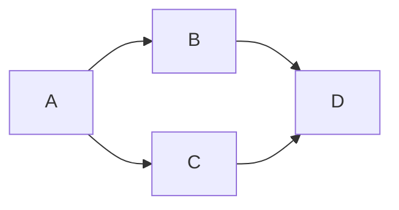

## go-analyse 

分析 Go 文件中的函数调用关系并用 mermaid 流程图进行可视化


### 运行

```shell
go run main.go --dir ./files --out_dir ./
```

### Markdown mermaid 渲染支持测试


```mermaid
flowchart LR
A --> B
A --> C
B --> D
C --> D
```
